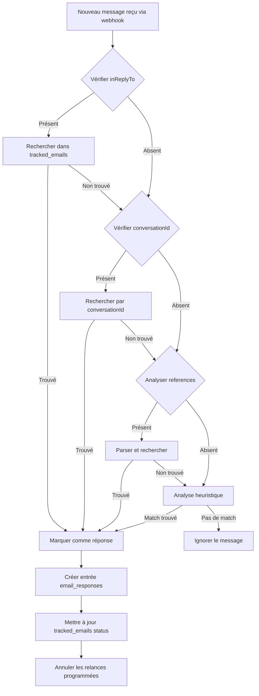

# Flux de Détection des Réponses - Microsoft Graph

## Vue d'ensemble

Microsoft Graph offre plusieurs mécanismes pour détecter les réponses aux emails grâce aux **webhooks** et aux propriétés des messages. L'application utilisera une combinaison de ces fonctionnalités pour une détection fiable.

## 1. Mécanisme de détection basé sur les Webhooks

### Configuration des Subscriptions

```typescript
interface EmailSubscription {
  changeType: "created" | "updated";
  notificationUrl: string;
  resource: string;
  expirationDateTime: Date;
  clientState: string;
  includeResourceData?: boolean;
}
```

### Souscriptions requises

```javascript
// 1. Souscription pour les nouveaux messages (détection des réponses)
POST https://graph.microsoft.com/v1.0/subscriptions
{
  "changeType": "created",
  "notificationUrl": "https://your-app.supabase.co/functions/v1/webhook-handler",
  "resource": "/users/{mailbox-id}/messages",
  "expirationDateTime": "2024-01-01T00:00:00Z",
  "clientState": "secretClientState"
}

// 2. Souscription pour les messages dans l'Inbox (avec filtre)
POST https://graph.microsoft.com/v1.0/subscriptions
{
  "changeType": "created",
  "notificationUrl": "https://your-app.supabase.co/functions/v1/webhook-handler",
  "resource": "/users/{mailbox-id}/mailFolders('inbox')/messages",
  "expirationDateTime": "2024-01-01T00:00:00Z",
  "clientState": "secretClientState"
}
```

## 2. Détection des réponses via les propriétés des messages

### Propriétés clés pour identifier une réponse

```typescript
interface MessageProperties {
  // Identifiants de conversation
  conversationId: string; // ID unique de la conversation
  conversationIndex: string; // Index pour l'ordre chronologique
  internetMessageId: string; // ID unique du message

  // Références pour le threading
  inReplyTo?: string; // ID du message auquel on répond
  references?: string; // Chaîne des IDs de messages précédents

  // Métadonnées
  subject: string; // Sujet (contient souvent "RE:")
  from: EmailAddress; // Expéditeur
  toRecipients: EmailAddress[]; // Destinataires
  receivedDateTime: Date; // Date de réception

  // Indicateurs supplémentaires
  isRead: boolean;
  isDraft: boolean;
  importance: "low" | "normal" | "high";
}
```

## 3. Algorithme de détection des réponses

```typescript
class ResponseDetector {
  /**
   * Détermine si un message entrant est une réponse à un email suivi
   */
  async isResponseToTrackedEmail(
    incomingMessage: Message
  ): Promise<TrackedEmail | null> {
    // Étape 0: Exclure les emails du même domaine/tenant
    if (this.isInternalEmail(incomingMessage)) {
      return null;
    }

    // Étape 1: Vérifier si c'est une réponse directe via inReplyTo
    if (incomingMessage.inReplyTo) {
      const trackedEmail = await this.findTrackedEmailByMessageId(
        incomingMessage.inReplyTo
      );
      // Vérifier que l'email n'a pas déjà reçu de réponse
      if (trackedEmail && trackedEmail.status === "pending") {
        return trackedEmail;
      }
    }

    // Étape 2: Vérifier via conversationId
    if (incomingMessage.conversationId) {
      const trackedEmail = await this.findTrackedEmailByConversationId(
        incomingMessage.conversationId
      );
      // Vérifier que l'email n'a pas déjà reçu de réponse
      if (trackedEmail && trackedEmail.status === "pending") {
        return trackedEmail;
      }
    }

    // Étape 3: Vérifier via les références (thread complet)
    if (incomingMessage.references) {
      const messageIds = this.parseReferences(incomingMessage.references);
      for (const messageId of messageIds) {
        const trackedEmail = await this.findTrackedEmailByMessageId(messageId);
        // Vérifier que l'email n'a pas déjà reçu de réponse
        if (trackedEmail && trackedEmail.status === "pending") {
          return trackedEmail;
        }
      }
    }

    // Étape 4: Analyse heuristique basée sur le sujet et les participants
    return await this.heuristicMatching(incomingMessage);
  }

  /**
   * Vérifie si l'email provient du même domaine/tenant
   */
  private isInternalEmail(message: Message): boolean {
    const tenantDomain = Deno.env.get("TENANT_DOMAIN"); // ex: @company.com
    return message.from.emailAddress.address.endsWith(tenantDomain);
  }

  /**
   * Analyse heuristique pour les cas complexes
   */
  async heuristicMatching(message: Message): Promise<TrackedEmail | null> {
    // Nettoyer le sujet (enlever RE:, FW:, etc.)
    const cleanSubject = this.cleanSubject(message.subject);

    // Chercher des emails avec le même sujet
    const candidates = await this.findTrackedEmailsBySubject(cleanSubject);

    // Filtrer par participants et statut
    const matches = candidates.filter(email => {
      // L'expéditeur de la réponse était destinataire de l'email original
      // ET l'email n'a pas encore reçu de réponse
      return (
        email.recipient_emails.includes(message.from.emailAddress.address) &&
        email.status === "pending"
      );
    });

    // Retourner le match le plus récent
    return matches.length > 0 ? matches[0] : null;
  }

  private cleanSubject(subject: string): string {
    // Enlever les préfixes de réponse/transfert
    return subject
      .replace(/^(RE:|FW:|FWD:|TR:)\s*/gi, "")
      .replace(/^\[.*?\]\s*/, "") // Enlever les tags
      .trim();
  }
}
```

## 4. Workflow complet de détection



## 5. Gestion des cas particuliers

### Réponses automatiques

```typescript
function isAutoResponse(message: Message): boolean {
  const autoResponseHeaders = [
    "X-Autoreply",
    "X-Autorespond",
    "Auto-Submitted",
  ];

  // Vérifier les headers spécifiques
  const hasAutoHeader = autoResponseHeaders.some(header =>
    message.internetMessageHeaders?.find(h => h.name === header)
  );

  // Vérifier les patterns dans le sujet
  const autoPatterns = [
    /out of office/i,
    /automatic reply/i,
    /auto.?reply/i,
    /vacation/i,
    /absent/i,
  ];

  const hasAutoPattern = autoPatterns.some(pattern =>
    pattern.test(message.subject)
  );

  return hasAutoHeader || hasAutoPattern;
}
```

### Emails transférés

```typescript
function isForwardedResponse(message: Message): boolean {
  // Détecter si c'est un forward
  const isForward = /^FW:|^FWD:/i.test(message.subject);

  if (isForward) {
    // Analyser le corps pour trouver l'email original
    const originalMessageId = extractOriginalMessageId(message.body);
    return originalMessageId !== null;
  }

  return false;
}
```

### Bounces et échecs de livraison

```typescript
interface BounceDetection {
  isBounce: boolean;
  bounceType?: "hard" | "soft";
  reason?: string;
}

function detectBounce(message: Message): BounceDetection {
  const bouncePatterns = {
    hard: [
      /user unknown/i,
      /no such user/i,
      /mailbox not found/i,
      /invalid recipient/i,
    ],
    soft: [
      /mailbox full/i,
      /quota exceeded/i,
      /temporarily unavailable/i,
      /try again later/i,
    ],
  };

  // Vérifier l'expéditeur (souvent postmaster ou mailer-daemon)
  const isBounceFrom = /postmaster|mailer-daemon|noreply/i.test(
    message.from.emailAddress.address
  );

  if (isBounceFrom) {
    // Analyser le contenu pour déterminer le type
    for (const [type, patterns] of Object.entries(bouncePatterns)) {
      for (const pattern of patterns) {
        if (pattern.test(message.body.content)) {
          return {
            isBounce: true,
            bounceType: type as "hard" | "soft",
            reason: message.body.content.match(pattern)?.[0],
          };
        }
      }
    }
  }

  return { isBounce: false };
}
```

## 6. Implementation dans Supabase Edge Function

```typescript
// supabase/functions/webhook-handler/index.ts
import { serve } from "https://deno.land/std@0.168.0/http/server.ts";
import { createClient } from "https://esm.sh/@supabase/supabase-js@2";

serve(async req => {
  // Validation du webhook
  const clientState = req.headers.get("clientState");
  if (clientState !== Deno.env.get("WEBHOOK_CLIENT_STATE")) {
    return new Response("Unauthorized", { status: 401 });
  }

  const notifications = await req.json();
  const supabase = createClient(
    Deno.env.get("SUPABASE_URL")!,
    Deno.env.get("SUPABASE_SERVICE_KEY")!
  );

  for (const notification of notifications.value) {
    if (notification.changeType === "created") {
      // Récupérer les détails complets du message
      const messageDetails = await fetchMessageDetails(notification.resource);

      // Détecter si c'est une réponse
      const detector = new ResponseDetector(supabase);
      const trackedEmail =
        await detector.isResponseToTrackedEmail(messageDetails);

      if (trackedEmail) {
        // Vérifier qu'une réponse n'a pas déjà été enregistrée (première réponse uniquement)
        const existingResponse = await supabase
          .from("email_responses")
          .select("id")
          .eq("tracked_email_id", trackedEmail.id)
          .single();

        if (!existingResponse.data) {
          // Enregistrer la première réponse
          await supabase.from("email_responses").insert({
            tracked_email_id: trackedEmail.id,
            microsoft_message_id: messageDetails.id,
            sender_email: messageDetails.from.emailAddress.address,
            subject: messageDetails.subject,
            body_preview: messageDetails.bodyPreview,
            received_at: messageDetails.receivedDateTime,
            response_type: determineResponseType(messageDetails),
            is_auto_response: isAutoResponse(messageDetails),
          });

          // Mettre à jour le statut si ce n'est pas une réponse auto
          if (!isAutoResponse(messageDetails)) {
            await supabase
              .from("tracked_emails")
              .update({
                status: "responded",
                responded_at: messageDetails.receivedDateTime,
              })
              .eq("id", trackedEmail.id)
              .eq("status", "pending"); // S'assurer qu'on ne met à jour que si encore en attente

            // Annuler les relances programmées
            await supabase
              .from("followups")
              .update({ status: "cancelled" })
              .eq("tracked_email_id", trackedEmail.id)
              .eq("status", "scheduled");
          }
        }
        // Si une réponse existe déjà, ignorer cette nouvelle réponse
      }
    }
  }

  return new Response("OK", { status: 200 });
});
```

## 7. Configuration recommandée

### Limites et optimisations

```yaml
webhook_config:
  max_subscriptions_per_mailbox: 2 # created + updated
  renewal_buffer_minutes: 60 # Renouveler 1h avant expiration
  max_expiration_days: 3 # Limite Graph API

detection_config:
  primary_method: "conversationId" # Plus fiable
  fallback_methods:
    - "inReplyTo"
    - "references"
    - "heuristic"

  heuristic_config:
    subject_similarity_threshold: 0.85
    max_time_window_hours: 168 # 7 jours

performance:
  cache_conversation_mappings: true
  cache_ttl_minutes: 60
  batch_webhook_processing: true
  max_batch_size: 100
```

### Monitoring et métriques

```typescript
interface DetectionMetrics {
  total_messages_processed: number;
  responses_detected: number;
  detection_methods: {
    conversation_id: number;
    in_reply_to: number;
    references: number;
    heuristic: number;
  };
  auto_responses_filtered: number;
  bounces_detected: number;
  average_detection_time_ms: number;
}
```

## 8. Points d'attention

1. **Latence des webhooks**: Les notifications peuvent avoir jusqu'à 3 minutes de délai
2. **Renouvellement des subscriptions**: Maximum 3 jours, nécessite renouvellement automatique
3. **Rate limiting**: Microsoft Graph limite à 10000 requêtes/10 minutes par app
4. **Première réponse uniquement**: Dès qu'une première réponse est détectée, arrêter le suivi (ignorer les réponses ultérieures)
5. **Exclusion des emails internes**: Toujours exclure les emails provenant du même domaine/tenant
6. **Threading complexe**: Certains clients mail cassent le threading standard
